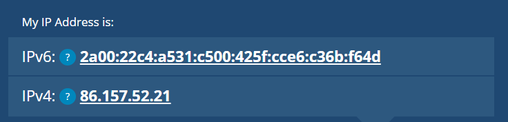

# Networking Fundamentals

## What is Networking?

Networks are simply things connected, it can be found in all walks of life such as meeting new people. In computing, networking is the same idea, network is formed by anywhere from 2 devices to billions.

## What is the Internet?

The internet is a giant network that consists of many small networks within itself, it allows devices and servers to communicate and share information through set of standardized protocols known as Internet Protocol (IP)

**Commonly Used Protocols**

- TCP: connection-oriented, ensures reliable data transmission (web browsing, email) [Reliability > Speed]
- UDP: connectionless, provides faster, communication for applications like live streaming or gaming, packets may be lost. [Speed > Reliability]

## Internet vs Intranet vs Extranet

- The Internet is a global network that connects millions of private, public, academic, business, and government networks worldwide. It allows access to information and services on a large scale. (Public)
- An Intranet is a private network used within an organization to securely share resources, communicate, and collaborate among employees. (private)
- An Extranet is an extended Intranet that allows limited access to external users, such as vendors, partners, or customers, while maintaining a secure connection.

## Identifying Devices on a Network

**Humans**

- Name (mutable, name changed)
- Fingerprint (immutable)

**Device**

- IP Address (mutable)
- MAC Address (Media Access Control, immutable)

### IP Address

- Used for communication across different networks
- Identify a host on a network, operates at Layer 3 of the OSI model
- Made up of 4 octets, between the range of 0 and 255 (inclusive)
- Mutable
- Public address -> identify devices on the internet
- Private address -> identify devices amongst other devices

**IPv4**

- 2^32 IP address (~4.29 billions)
- Router address (Wifi A - same)
  - iPhone private IP address (different)
  - MacBook Pro private IP address (different)
- Running out of IP address as more devices are connected to the internet
- No built-in encryption or authentication
- Security relies on external protocols like IPSec
- Manual configuration or DHCP (Dynamic Host Configuration Protocol) is used.
- Uses NAT (Network Address Translation) to allow multiple devices to share a single public IP.

**IPv6**

- Newer iteration, up to 2^128 IP address (~340 trillion)
- Solves the limitation of IPv4
- IPSec is built-in, providing confidentiality, integrity and authentication
- Supports auto configuration: Devices can generate their own addresses using their MAC address and network prefix.
- NAT is not required because of the abundant address space.

### MAC Address

- Hardware identifier, operates at Layer 2 of the OSI model
- Used for communication within a local network
- Not used for routing, works only within the same local network
- Found in device's motherboard
- Assigned a unique address at the factory (MAC)
- 12 character hexadecimal number
- First 6 digit represents the company, last 6 represents a unique number
- Can be spoofed - ARP poisoning
- Networked device pretends to identify as another using its MAC address

## Switch vs Router

### Switch

- Operates within a local area network (LAN)
- Main job is to connect devices (computers, printers, servers) in a LAN and enable them to communicate
- Forwards data between devices based on their **MAC addresses**

### Router

- Connects **different networks** together, such as a home network to the internet
- Forwards data between networks based on **IP addresses**
- Consists of other additional features such as NAT, firewall etc

## What is IPSec and why is it important?

IPSec (Internet Protocol Security) is a framework of protocols used to secure communications over IP networks by providing confidentiality, integrity, and authentication. It ensures that data traveling across a network (e.g., the internet) is encrypted and protected from tampering or unauthorized access.

IPSec operates at the Network Layer (Layer 3) of the OSI model, making it versatile for securing any type of IP traffic.

Networking methods are not encrypted by default. Networking protocols such as TCP/IP are only concerned with connection and delivery, and messages sent are not concealed - which means that anyone in the middle can read them. IPSec and other protocols encrypt these data, keeping it secure.

## What is ARP?

ARP (Address Resolution Protocol) is a network protocol used to map an IP address to a corresponding MAC address within a local network. It operates at the Data Link Layer (Layer 2) of the OSI model.

### Why ARP Is Needed

- Devices communicate over networks using IP addresses (logical addresses).
- However, at the hardware level, communication is based on MAC addresses (physical addresses).
- ARP resolves the gap by linking the logical IP address to the physical MAC address.

### How ARP Works

When a device wants to communicate with another device in the same local network:

1. Device sends an ARP request:
   - The device broadcasts a message to the local network, asking:
     “Who has IP address X.X.X.X? Tell me your MAC address.”
   - The ARP request is sent to all devices in the network (broadcast: MAC address FF:FF:FF:FF:FF:FF).
2. Target device responds with ARP reply:
   - The device with the requested IP address replies directly to the sender with its MAC address.
3. Mapping is stored in ARP cache:
   - The sender stores the IP-to-MAC mapping in its ARP cache (a table) to avoid sending repeated ARP requests for future communication.

### ARP in Action

Example: Device A wants to communicate with Device B (in the same network)

- Device A: IP = 192.168.1.10, MAC = 00:1A:2B:3C:4D:5E
- Device B: IP = 192.168.1.20, MAC = 11:22:33:44:55:66

1. Device A sends an ARP request:
   “Who has IP 192.168.1.20? Tell me your MAC address.”
2. Device B responds with an ARP reply:
   “I have IP 192.168.1.20. My MAC address is 11:22:33:44:55:66.”
3. Device A stores this information in its ARP cache.

### When ARP is Used

1. Local Communication:
   - ARP is used only within the same local network (subnet).
   - For communication across different networks, the default gateway (router) handles the process.
2. Examples:
   - Your computer uses ARP to find the MAC address of your home router when accessing the Internet.
   - Devices in a LAN use ARP to find each other for file sharing or local services.

## What is ARP poisoning?

ARP poisoning (ARP spoofing) is a man-in-the-middle (MITM) attack in which an attacker sends fake ARP (Address Resolution Protocol) messages onto a local network. The goal of ARP spoofing is to associate the attacker’s MAC address with the IP address of another device (usually a gateway or another victim device) on the network.

**How it works**

- Attacker sends fake ARP message, attacker tells Device A "I am the router at 192.168.1.1"
- Device A updates its ARP table to map the attacker's MAC address with the router's IP address
- The traffic now meant for the router is sent to the attacker instead
- The attacker can now intercept, modify or drop packets

**Impact**

- Intercept traffic, eavesdrop on communication between devices
- Modify traffic in transit
- Launch DDoS or MitM attacks

**Prevention**

- Use static ARP entries, manually assign MAC-to-IP mappings for critical devices
- Enable ARP spoofing detection
- Use secure protocols like HTTPS, SSH, VPNs to protect data
- Divide networks into smaller segments
- Implement dynamic ARP inspection
- Monitor networking traffic
- Use IPv6 as it uses Neighbor Discovery Protocol (NDP) instead of ARP

## Commonly Used Internet Protocols

Internet protocols are standardized rules and conventions that govern how data is transmitted and received over the internet or any computer network. These protocols ensure that devices and applications can communicate effectively and securely with each other.

**Application Layer (Layer 7)**

These protocols are used for communication between applications on different devices.

- HTTP (Hypertext Transfer Protocol): Used for web browsing (HTTP and HTTPS).
- HTTPS (Hypertext Transfer Protocol Secure): A secure version of HTTP using SSL/TLS encryption.
- FTP (File Transfer Protocol): Used for transferring files between systems over a TCP/IP network.
- SFTP (SSH File Transfer Protocol): A secure version of FTP using SSH for encryption.
- SMTP (Simple Mail Transfer Protocol): Used for sending and routing emails.
- IMAP (Internet Message Access Protocol): Used by email clients to retrieve emails from a server.
- POP3 (Post Office Protocol version 3): Used for retrieving emails from a server, though it downloads and deletes messages from the server.
- DNS (Domain Name System): Resolves human-readable domain names e.g. <https://www.apple.com> into IP addresses.
- DHCP (Dynamic Host Configuration Protocol): Assigns dynamic IP addresses to devices on a network.
- Telnet: Provides remote access to devices and systems over a network (not secure).
- SSH (Secure Shell): Provides secure remote access to devices, replacing Telnet for secure communication.
- SNMP (Simple Network Management Protocol): Used for managing and monitoring network devices like routers and switches.

**Transport Layer (Layer 4)**

These protocols control the flow of data between devices.

- TCP (Transmission Control Protocol): Provides reliable, connection-oriented communication for data transmission.
- UDP (User Datagram Protocol): Provides connectionless communication, used when speed is more critical than reliability (e.g., video streaming).
- SCTP (Stream Control Transmission Protocol): Similar to TCP but designed for more complex network applications.

**Network Layer (Layer 3)**

These protocols are responsible for routing data across the network.

- IP (Internet Protocol): The primary protocol for addressing and routing packets of data between devices on a network (IPv4 and IPv6).
- ICMP (Internet Control Message Protocol): Used for error reporting and diagnostics (e.g., ping command).
- ARP (Address Resolution Protocol): Resolves IP addresses to MAC addresses on a local network.
- RARP (Reverse Address Resolution Protocol): Resolves MAC addresses to IP addresses (less commonly used today).
- IGMP (Internet Group Management Protocol): Manages multicast group memberships.
- IPsec (Internet Protocol Security): Provides encryption, authentication, and data integrity for IP traffic.

**Data Link Layer (Layer 2)**

These protocols deal with the communication between devices on the same network.

- Ethernet: A common protocol for wired local area networks (LANs) that uses MAC addresses for communication.
- PPP (Point-to-Point Protocol): Used for direct communication between two devices over a serial link (e.g., dial-up connections).
- Wi-Fi (IEEE 802.11): Wireless communication protocol for local area networks (WLANs).

**Physical Layer (Layer 1)**

Protocols in this layer are concerned with the physical transmission of data.

- DSL (Digital Subscriber Line): A technology for high-speed internet over telephone lines.
- Ethernet (IEEE 802.3): A protocol that defines physical and data link layer standards for local area networks.
- Wi-Fi (IEEE 802.11): Defines the physical and data link layers for wireless local area networks.

**Other Important Protocols**

- BGP (Border Gateway Protocol): Used for routing between autonomous systems (AS) on the internet.
- OSPF (Open Shortest Path First): A routing protocol used within a single autonomous system (AS).
- NTP (Network Time Protocol): Synchronizes clocks on devices across the network.
- SSL/TLS (Secure Sockets Layer / Transport Layer Security): Protocols used to secure communication on the internet, often in combination with HTTP (HTTPS).
- IPX/SPX (Internetwork Packet Exchange / Sequenced Packet Exchange): A protocol suite used in legacy networks, primarily in Novell NetWare environments.
- L2TP (Layer 2 Tunneling Protocol): A tunneling protocol used for creating VPNs.

## Ping

- Uses ICMP (Internet Control Message Protocol) packets to determine the performance of a connection between device
- `ping <IP address or website URL>`

## What is TCP?

[TCP](https://www.cloudflare.com/learning/ddos/glossary/tcp-ip/)

TCP (Transmission Control Protocol) is one of the core protocols of the Internet Protocol (IP) suite. It operates at the transport layer (Layer 4) of the OSI model and provides a reliable, connection-oriented communication channel between devices over a network.

### Three-way Handshake (Establish Connection - Layer 4)

- SYN Packet: The source sends an SYN packet to the target server to initiate the connection.
- SYN-ACK Packet: The target server responds with a SYN-ACK packet to acknowledge the connection request.
- ACK Packet: The source sends an ACK packet to confirm the connection, completing the 3-way handshake.
- Data Transfer: The email message is broken down into smaller packets for transmission.
- Routing: Packets traverse multiple gateways across the internet.
- Reassembly: Upon reaching the target device, TCP reassembles the packets into the original email content.

### Advantage

- Ensures reliable data delivery by providing acknowledgements
- Data arrives in order
- Flow control
- Use case
  - Web browsing
  - Email
  - Remote access (SSH)

TLDR, speed > reliability - UDP, otherwise TCP.

- UDP use case
  - DNS queries
  - Online gaming
  - Livestream

## What is a firewall and how does it function in network security?

- A firewall is a network security that monitors and control incoming/outgoing traffic based on pre-defined security rule.
- Purpose
  - Block unauthorized access and ensure that only legit traffic can go through
  - Security Gate (IDS - Security Guard)

### Network-based Firewalls

A network-based firewall is a hardware or software solution that controls traffic between different networks or between a network and the internet. It’s deployed at the network perimeter.

- Key Features:

  - Protects an entire network by filtering traffic at the boundary.
  - Can inspect and filter traffic based on IP addresses, ports, protocols, and application-layer data.
  - Often integrates with other network tools like VPNs, intrusion detection/prevention systems (IDS/IPS), and content filtering.

- Deployment:

  - Installed on the gateway or between subnets.
  - Example: On a router, dedicated firewall appliance (e.g., Cisco ASA, Palo Alto Networks), or as a cloud firewall.

- Use Cases:

  - Securing enterprise networks by filtering incoming and outgoing traffic.
  - Protecting cloud-based workloads.
  - Preventing external attacks like DDoS, port scans, or unauthorized access.

- Examples:
  - Cisco ASA, Palo Alto Networks NGFW, pfSense, AWS Security Groups.

### Host-based Firewalls

A host-based firewall is installed directly on an individual device (host) to monitor and control network traffic to and from that specific machine.

- Key Features:

  - Provides granular control over applications and processes accessing the network.
  - Filters traffic based on local rules and policies.
  - Protects the device from threats like unauthorized access, malware, and internal misuse.

- Deployment:

  - Installed as software on servers, desktops, or even IoT devices.
  - Example: Windows Defender Firewall, iptables, ufw (Linux).

- Use Cases:

  - Protecting sensitive devices or critical servers within a network.
  - Adding an extra layer of security to laptops or endpoints used remotely.
  - Blocking outgoing connections from malware on infected hosts.

- Examples:
  - Windows Firewall, iptables/ufw (Linux), macOS Firewall, CrowdStrike Falcon Host Firewall.

## What is a DNS?

DNS stands for Domain Name System, it is a system that translate human-readable domain name such as Apple.com into machine-readable IP address such as 192.168.1.1
DNS is like a phonebook of the internet so that we don't have to remember the complex IP address.

## What happens when you type a URL into the browser?

- Bob enters URL into the browser <https://www.apple.com/sg/iphone-16-pro/> and hits Enter.

  - Protocol: https
  - Domain: apple.com
  - Path: sg/
  - Resource: iphone-16-pro

- The browser looks up the IP address for the domain using a DNS lookup. To make the lookup process faster, data is cached at different layers

  - Browser cache
  - OS cache
  - Local network cache
  - ISP cache

- If the IP address cannot be found at any of the caches, the browser goes to the DNS servers to do a recursive DNS lookup until the IP address is found

- Now that the IP address is found, the browser establish a TCP connection with the server using a three-way handshake.

  - The client sends a SYN message to the server
  - The server responds with a SYN-ACK message
  - The client sends an ACK knowledge back to the server, completing the connection

- Since the connection is over HTTPS, the browser negotiates an SSL/TLS handshake with the server. This ensures that the data sent between the client and server is encrypted, maintaining privacy and integrity of the communication.

- The browser sends an HTTPS request to the server

- The server processes the request and sends back the response.

- The browser renders the HTML content.

## How does the internet work?

- The internet is a global network that uses protocols like TCP to communicate.
- When a device connects to the internet, it uses an IP address to identify itself.
- Data is transferred in packets over a series of routers, switches, and networks, ensuring communication between devices.
- Protocols like HTTP, DNS, and SMTP ensure specific functions like web browsing, domain name resolution, and email exchange.

## What happens when you visit Apple.com in the browser?

- Enter Apple.com into the browser
- Translate the URL (Apple.com) into an IP address
- The mapping is stored in a cache, and the browser look for the IP address in multiple layers of cache (browser, OS, local, ISP)
- If the IP address is not found, the browser will request the DNS resolver to resolve it
- The DNS resolver performs a recursive DNS look up until it is found
- Once the IP address is found, the browser sends a HTTP request to the server hosting Apple.com using TCP/IP protocol
- We should always use HTTPS for secure access.
- The browser initiates a TCP connection with the server via TCP 3-way handshake. (Establish the Communication)
- After the TCP connection is established, SSL/TLS takes over to secure the communication. This process ensures that data transmitted between the browser and server is encrypted and secure.
- The server sends its public key to the client, the client uses the public key to encrypt the session key and sends to the server.
- The server uses its private key to decrypt the session key.
- The secure channel is established, and now it can exchange encrypted data using the session key.
- The server processes the request and responds with the page's HTML, CSS, JavaScript and other static assets.
- The browser then processes the files and renders the page to the frontend.

## What happens when you do a search on Google?

- Enter Apple internship as part of the search query
- The browser resolves the IP address for Google's search service via DNS and establish a connection via HTTPS
- The search query, alongside metadata is sent to Google's server
- Google's algorithm will parse the query and identify keywords, retrieves relevant indexed webpages from its database and rank them based on factors like relevance, page quality, user location, and past behavior.
- Google then sends the ranked list of search results to the browser
- The browser then renders the result, and we can click on the links to further explore
