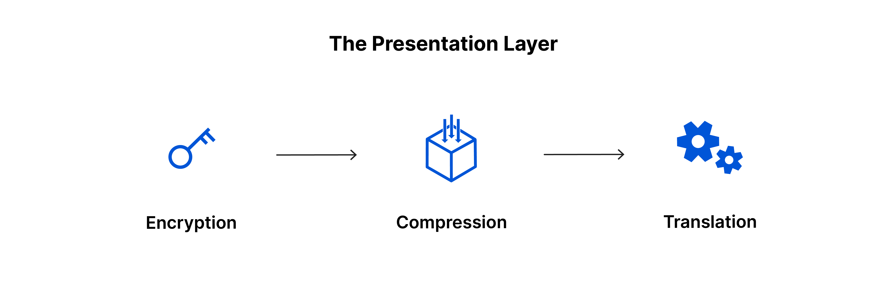

# Information Security Interview Preparation (Networking Fundamentals)

## What is Networking?

Networks are simply things connected, it can be found in all walks of life such as meeting new people. In computing, networking is the same idea, network is formed by anywhere from 2 devices to billions.

## What is the Internet?

The internet is a giant network that consists of many small networks within itself, it allows devices and servers to communicate and share information through set of standardized protocols known as Internet Protocol (IP)

**Commonly Used Protocols**

- TCP: ensures reliable data transmission (web browsing, email) [Reliability > Speed]
- UDP: provides faster, communication for applications like live streaming or gaming, packets may be lost. [Speed > Reliability]

## Identifying Devices on a Network

**Humans**

- Name (mutable, name changed)
- Fingerprint (immutable)

**Device**

- IP Address (mutable)
- MAC Address (Media Access Control, immutable)

### IP Address

- Identify a host on a network
- Made up of 4 octets, between the range of 0 and 255 (inclusive)
- Mutable
- Public address -> identify devices on the internet
- Private address -> identify devices amongst other devices

**IPv4**

- 2^32 IP address (~4.29 billions)
- Router address (Wifi A - same)
  - iPhone private IP address (different)
  - MacBook Pro private IP address (different)
- Running out of IP address as more devices are connected to the internet
- No built-in encryption or authentication
- Security relies on external protocols like IPSec
- Manual configuration or DHCP (Dynamic Host Configuration Protocol) is used.
- Uses NAT (Network Address Translation) to allow multiple devices to share a single public IP.

**IPv6**

- Newer iteration, up to 2^128 IP address (~340 trillion)
- Solves the limitation of IPv4
- IPSec is built-in, providing confidentiality, integrity and authentication
- Supports auto configuration: Devices can generate their own addresses using their MAC address and network prefix.
- NAT is not required because of the abundant address space.

### MAC Address

- Found in device's motherboard
- Assigned a unique address at the factory (MAC)
- 12 character hexadecimal number
- First 6 digit represents the company, last 6 represents a unique number
- Can be spoofed - ARP poisoning
- Networked device pretends to identify as another using its MAC address

## What is IPSec and why is it important?

IPSec (Internet Protocol Security) is a framework of protocols used to secure communications over IP networks by providing confidentiality, integrity, and authentication. It ensures that data traveling across a network (e.g., the internet) is encrypted and protected from tampering or unauthorized access.

IPSec operates at the Network Layer (Layer 3) of the OSI model, making it versatile for securing any type of IP traffic.

Networking methods are not encrypted by default. Networking protocols such as TCP/IP are only concerned with connection and delivery, and messages sent are not concealed - which means that anyone in the middle can read them. IPSec and other protocols encrypt these data, keeping it secure.

## What is ARP poisoning?

ARP poisoning (ARP spoofing) is a type of cyberattack in which an attacker sends false ARP to a network, tricking device into associating the attacker's MAC address with the IP address of another device.

**How it works**

- Attacker sends fake ARP message, attacker tells Device A "I am the router at 192.168.1.1"
- Device A updates its ARP table to map the attacker's MAC address with the router's IP address
- The traffic now meant for the router is sent to the attacker instead
- The attacker can now intercept, modify or drop packets

**Impact**

- Intercept traffic, eavesdrop on communication between devices
- Modify traffic in transit
- Launch DDoS or MitM attacks

**Prevention**

- Use static ARP entries, manually assign MAC-to-IP mappings for critical devices
- Enable ARP spoofing detection
- Use secure protocols like HTTPS, SSH, VPNs to protect data
- Divide networks into smaller segments
- Implement dynamic ARP inspection
- Monitor networking traffic
- Use IPv6 as it uses Neighbor Discovery Protocol (NDP) instead of ARP

## Commonly Used Internet Protocols

Internet protocols are standardized rules and conventions that govern how data is transmitted and received over the internet or any computer network. These protocols ensure that devices and applications can communicate effectively and securely with each other.

**Application Layer (Layer 7)**

These protocols are used for communication between applications on different devices.

- HTTP (Hypertext Transfer Protocol): Used for web browsing (HTTP and HTTPS).
- HTTPS (Hypertext Transfer Protocol Secure): A secure version of HTTP using SSL/TLS encryption.
- FTP (File Transfer Protocol): Used for transferring files between systems over a TCP/IP network.
- SFTP (SSH File Transfer Protocol): A secure version of FTP using SSH for encryption.
- SMTP (Simple Mail Transfer Protocol): Used for sending and routing emails.
- IMAP (Internet Message Access Protocol): Used by email clients to retrieve emails from a server.
- POP3 (Post Office Protocol version 3): Used for retrieving emails from a server, though it downloads and deletes messages from the server.
- DNS (Domain Name System): Resolves human-readable domain names e.g. <https://www.apple.com> into IP addresses.
- DHCP (Dynamic Host Configuration Protocol): Assigns dynamic IP addresses to devices on a network.
- Telnet: Provides remote access to devices and systems over a network (not secure).
- SSH (Secure Shell): Provides secure remote access to devices, replacing Telnet for secure communication.
- SNMP (Simple Network Management Protocol): Used for managing and monitoring network devices like routers and switches.

**Transport Layer (Layer 4)**

These protocols control the flow of data between devices.

- TCP (Transmission Control Protocol): Provides reliable, connection-oriented communication for data transmission.
- UDP (User Datagram Protocol): Provides connectionless communication, used when speed is more critical than reliability (e.g., video streaming).
- SCTP (Stream Control Transmission Protocol): Similar to TCP but designed for more complex network applications.

**Network Layer (Layer 3)**

These protocols are responsible for routing data across the network.

- IP (Internet Protocol): The primary protocol for addressing and routing packets of data between devices on a network (IPv4 and IPv6).
- ICMP (Internet Control Message Protocol): Used for error reporting and diagnostics (e.g., ping command).
- ARP (Address Resolution Protocol): Resolves IP addresses to MAC addresses on a local network.
- RARP (Reverse Address Resolution Protocol): Resolves MAC addresses to IP addresses (less commonly used today).
- IGMP (Internet Group Management Protocol): Manages multicast group memberships.
- IPsec (Internet Protocol Security): Provides encryption, authentication, and data integrity for IP traffic.

**Data Link Layer (Layer 2)**

These protocols deal with the communication between devices on the same network.

- Ethernet: A common protocol for wired local area networks (LANs) that uses MAC addresses for communication.
- PPP (Point-to-Point Protocol): Used for direct communication between two devices over a serial link (e.g., dial-up connections).
- Wi-Fi (IEEE 802.11): Wireless communication protocol for local area networks (WLANs).

**Physical Layer (Layer 1)**

Protocols in this layer are concerned with the physical transmission of data.

- DSL (Digital Subscriber Line): A technology for high-speed internet over telephone lines.
- Ethernet (IEEE 802.3): A protocol that defines physical and data link layer standards for local area networks.
- Wi-Fi (IEEE 802.11): Defines the physical and data link layers for wireless local area networks.

**Other Important Protocols**

- BGP (Border Gateway Protocol): Used for routing between autonomous systems (AS) on the internet.
- OSPF (Open Shortest Path First): A routing protocol used within a single autonomous system (AS).
- NTP (Network Time Protocol): Synchronizes clocks on devices across the network.
- SSL/TLS (Secure Sockets Layer / Transport Layer Security): Protocols used to secure communication on the internet, often in combination with HTTP (HTTPS).
- IPX/SPX (Internetwork Packet Exchange / Sequenced Packet Exchange): A protocol suite used in legacy networks, primarily in Novell NetWare environments.
- L2TP (Layer 2 Tunneling Protocol): A tunneling protocol used for creating VPNs.

## Ping

- Uses ICMP (Internet Control Message Protocol) packets to determine the performance of a connection between device
- `ping <IP address or website URL>`

## TCP

[TCP](https://www.cloudflare.com/learning/ddos/glossary/tcp-ip/)

### Three-way Handshake (Establish Connection - Layer 4)

- SYN Packet: The source sends an SYN packet to the target server to initiate the connection.
- SYN-ACK Packet: The target server responds with a SYN-ACK packet to acknowledge the connection request.
- ACK Packet: The source sends an ACK packet to confirm the connection, completing the 3-way handshake.
- Data Transfer: The email message is broken down into smaller packets for transmission.
- Routing: Packets traverse multiple gateways across the internet.
- Reassembly: Upon reaching the target device, TCP reassembles the packets into the original email content.

### Advantage

- Ensures reliable data delivery by providing acknowledgements
- Data arrives in order
- Flow control
- Use case
  - Web browsing
  - Email
  - Remote access (SSH)

TLDR, speed > reliability - UDP, otherwise TCP.

- UDP use case
  - DNS queries
  - Online gaming
  - Livestream

## OSI Model (Open Systems Interconnection)

- The OSI model breaks down network communication into 7 distinct layers
- Purpose: understand how different networking protocols interact with each other and how data flows across a network
- Each layer handles communication and job with the layer above and below itself.

### Layer 7 - The Application Layer

- Only layer that directly interacts with data from the user
- Helps to initiate communication via protocols such as HTTP and SMTP

### Layer 6 - The Presentation Layer

- Prepare data to be used by the application layer
- Layer 6 makes the data presentation for application to consume
- Responsible for translation, encryption, compression of data
- For encryption, layer 6 will encrypt on sender end and decrypt on receiver end so that it can present the application layer with unencrypted, readable data
- Compresses data it receives from layer 7 before delivering it to layer 5 to improve speed and efficiency

### Layer 5 - The Session Layer

- Responsible for opening/closing communication between 2 devices known as session
- Stay open long enough to transfer all the data, but promptly closes to avoid wasting resources

### Layer 4 - The Transport Layer

- Responsible for end-to-end communication between 2 devices
- Take data from session layer and break up into chunks called segments before sending to layer 3.
- Receiving device is responsible for reassembling the segments into the data the session layer can consume
- Responsible for flow control and error control
- Determines optimal speed of transmission to ensure that sender with fast connection does not overwhelm receiver with slow connection
- Error control on receiving end by ensuring that data received is complete and request a retransmission if it isn't
- Communication stops here if you are developing a full-stack application on the same machine.
- Protocols - TCP, UDP

### Layer 3 - The Network Layer

- Responsible for facilitating data transfer between 2 different networks
- If both devices communicate on the same network (localhost and localhost), this layer is not needed.
- Breaks up segments from the transport layer into small units called packets on the sender's device
- Reassemble these packets on the receiving device
- Finds the best physical path for the data to reach its destination known as Routing
- Protocols - IP, ICMP, IGMP, IPsec

### Layer 2 - The Data Link Layer

- Similar to network layer except this facilitates data transfer between 2 devices on the same network.
- Takes packets from the network layer and breaks them into smaller pieces called frames.
- Responsible for flow control and error control for intra-network communication.

### Layer 1 - The Physical Layer

- Involves physical equipment involved in data transfer such as cables and switches
- Data gets converted into bit stream, (0s and 1s)
- The physical layer of both devices must also agree on a signal convention so that 1s can be distinguished from the 0s on both devices.

### How data flows through the OSI Model

In order for human-readable information to be transferred over a network from one device to another, the data must travel down the seven layers of the OSI Model on the sending device and then travel up the seven layers on the receiving end.

For example: Mr. Cooper wants to send Ms. Palmer an email. Mr. Cooper composes his message in an email application on his laptop and then hits ‘send’. His email application will pass his email message over to the application layer, which will pick a protocol (SMTP) and pass the data along to the presentation layer. The presentation layer will then compress the data and then it will hit the session layer, which will initialize the communication session.

The data will then hit the sender’s transportation layer where it will be segmented, then those segments will be broken up into packets at the network layer, which will be broken down even further into frames at the data link layer. The data link layer will then deliver those frames to the physical layer, which will convert the data into a bitstream of 1s and 0s and send it through a physical medium, such as a cable.

Once Ms. Palmer’s computer receives the bit stream through a physical medium (such as her wifi), the data will flow through the same series of layers on her device, but in the opposite order. First the physical layer will convert the bitstream from 1s and 0s into frames that get passed to the data link layer. The data link layer will then reassemble the frames into packets for the network layer. The network layer will then make segments out of the packets for the transport layer, which will reassemble the segments into one piece of data.

The data will then flow into the receiver's session layer, which will pass the data along to the presentation layer and then end the communication session. The presentation layer will then remove the compression and pass the raw data up to the application layer. The application layer will then feed the human-readable data along to Ms. Palmer’s email software, which will allow her to read Mr. Cooper’s email on her laptop screen.

### Data Flow

Sender: Layer 7 -> Layer 1

1. Application: Application creates data (e.g., sending an email).
2. Presentation: Data is formatted, encrypted, or compressed.
3. Session: The session between the sender and receiver is initiated.
4. Transport: Data is segmented into smaller packets, and error-checking is performed (e.g., TCP ensures reliability).
5. Network: The data packet is routed based on IP addresses.
6. Data Link: The data packet is framed with physical addresses (MAC address) for local delivery.
7. Physical: The data is transmitted as electrical signals or light pulses.

Receiver: Layer 1 -> Layer 7

1. Physical: Signals are received and converted into bits.
2. Data Link: Data is extracted from the physical frames.
3. Network: Data is routed to the correct destination.
4. Transp