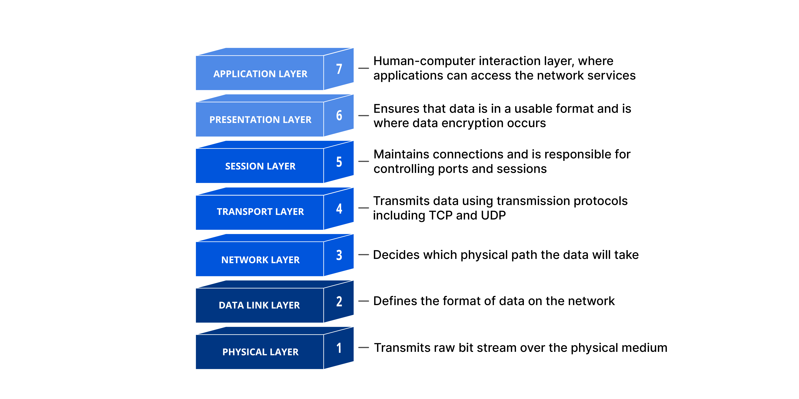
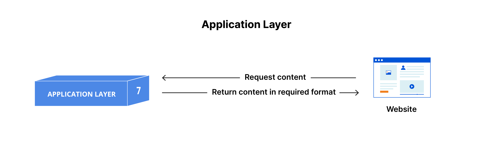
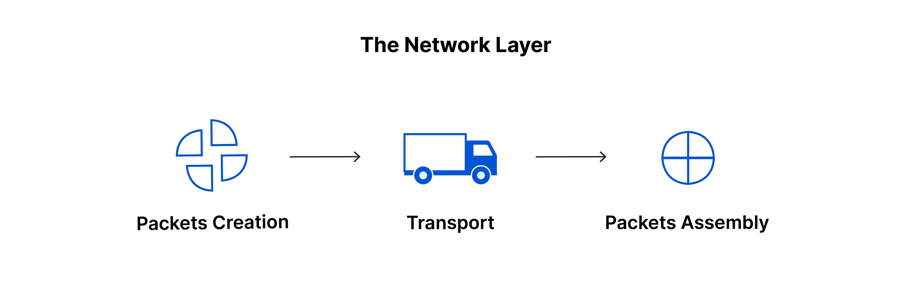
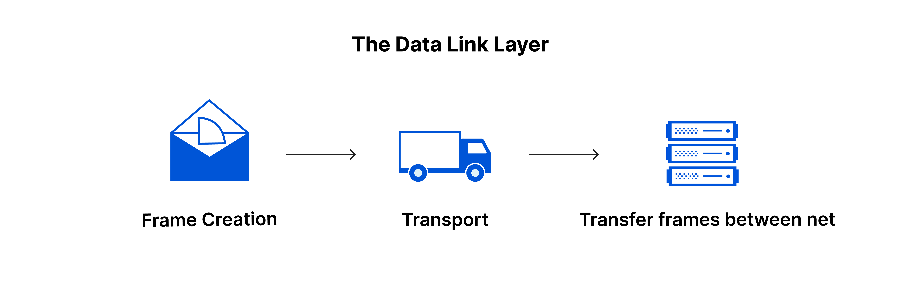
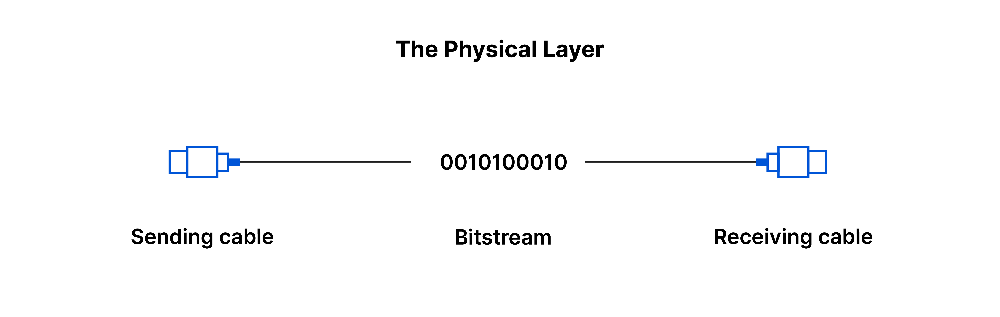

# OSI Model (Open Systems Interconnection)

- The OSI model breaks down network communication into 7 distinct layers
- Purpose: understand how different networking protocols interact with each other and how data flows across a network
- Each layer handles communication and job with the layer above and below itself.

## Layer 7 - The Application Layer

- Only layer that directly interacts with data from the user
- Helps to initiate communication via protocols such as HTTP and SMTP

## Layer 6 - The Presentation Layer

- Prepare data to be used by the application layer
- Layer 6 makes the data presentation for application to consume
- Responsible for translation, encryption, compression of data
- For encryption, layer 6 will encrypt on sender end and decrypt on receiver end so that it can present the application layer with unencrypted, readable data
- Compresses data it receives from layer 7 before delivering it to layer 5 to improve speed and efficiency

## Layer 5 - The Session Layer

- Responsible for opening/closing communication between 2 devices known as session
- Stay open long enough to transfer all the data, but promptly closes to avoid wasting resources

## Layer 4 - The Transport Layer

- Responsible for end-to-end communication between 2 devices
- Take data from session layer and break up into chunks called segments before sending to layer 3.
- Receiving device is responsible for reassembling the segments into the data the session layer can consume
- Responsible for flow control and error control
- Determines optimal speed of transmission to ensure that sender with fast connection does not overwhelm receiver with slow connection
- Error control on receiving end by ensuring that data received is complete and request a retransmission if it isn't
- Communication stops here if you are developing a full-stack application on the same machine.
- Protocols - TCP, UDP

## Layer 3 - The Network Layer

- Responsible for facilitating data transfer between 2 different networks
- If both devices communicate on the same network (localhost and localhost), this layer is not needed.
- Breaks up segments from the transport layer into small units called packets on the sender's device
- Reassemble these packets on the receiving device
- Finds the best physical path for the data to reach its destination known as Routing
- Protocols - IP, ICMP, IGMP, IPsec

## Layer 2 - The Data Link Layer

- Similar to network layer except this facilitates data transfer between 2 devices on the same network.
- Takes packets from the network layer and breaks them into smaller pieces called frames.
- Responsible for flow control and error control for intra-network communication.

## Layer 1 - The Physical Layer

- Involves physical equipment involved in data transfer such as cables and switches
- Data gets converted into bit stream, (0s and 1s)
- The physical layer of both devices must also agree on a signal convention so that 1s can be distinguished from the 0s on both devices.

## How data flows through the OSI Model

In order for human-readable information to be transferred over a network from one device to another, the data must travel down the seven layers of the OSI Model on the sending device and then travel up the seven layers on the receiving end.

For example: Mr. Cooper wants to send Ms. Palmer an email. Mr. Cooper composes his message in an email application on his laptop and then hits ‘send’. His email application will pass his email message over to the application layer, which will pick a protocol (SMTP) and pass the data along to the presentation layer. The presentation layer will then compress the data and then it will hit the session layer, which will initialize the communication session.

The data will then hit the sender’s transportation layer where it will be segmented, then those segments will be broken up into packets at the network layer, which will be broken down even further into frames at the data link layer. The data link layer will then deliver those frames to the physical layer, which will convert the data into a bitstream of 1s and 0s and send it through a physical medium, such as a cable.

Once Ms. Palmer’s computer receives the bit stream through a physical medium (such as her wifi), the data will flow through the same series of layers on her device, but in the opposite order. First the physical layer will convert the bitstream from 1s and 0s into frames that get passed to the data link layer. The data link layer will then reassemble the frames into packets for the network layer. The network layer will then make segments out of the packets for the transport layer, which will reassemble the segments into one piece of data.

The data will then flow into the receiver's session layer, which will pass the data along to the presentation layer and then end the communication session. The presentation layer will then remove the compression and pass the raw data up to the application layer. The application layer will then feed the human-readable data along to Ms. Palmer’s email software, which will allow her to read Mr. Cooper’s email on her laptop screen.

## Data Flow

Sender: Layer 7 -> Layer 1

1. Application: Application creates data (e.g., sending an email).
2. Presentation: Data is formatted, encrypted, or compressed.
3. Session: The session between the sender and receiver is initiated.
4. Transport: Data is segmented into smaller packets, and error-checking is performed (e.g., TCP ensures reliability).
5. Network: The data packet is routed based on IP addresses.
6. Data Link: The data packet is framed with physical addresses (MAC address) for local delivery.
7. Physical: The data is transmitted as electrical signals or light pulses.

Receiver: Layer 1 -> Layer 7

1. Physical: Signals are received and converted into bits.
2. Data Link: Data is extracted from the physical frames.
3. Network: Data is routed to the correct destination.
4. Transport: Segments are reassembled, and error correction is applied.
5. Session: The session is maintained.
6. Presentation: Data is decrypted and decompressed, if necessary.
7. Application: Data is presented to the user or application.

### Information Security Context

#### Layer 7: Application Layer

- Security Focus: This layer deals with user-facing applications and network services.
- Risks: Vulnerabilities like SQL injection, Cross-Site Scripting (XSS), and buffer overflows can be exploited here.
- Security Measures:
  - Implement input validation to prevent injection attacks.
  - Use encryption for sensitive data in transit.
  - Web Application Firewalls (WAFs) can help protect web apps.

#### Layer 6: Presentation Layer

- Security Focus: This layer is responsible for data formatting, encryption, and compression.
- Risks: Poor encryption practices or misconfigured settings can expose sensitive data.
- Security Measures:
  - Use strong end-to-end encryption (e.g., TLS/SSL for secure communications).
  - Ensure proper handling of data compression and decompression to avoid vulnerabilities.

#### Layer 5: Session Layer

- Security Focus: The session layer establishes, maintains, and terminates communication sessions.
- Risks: Man-in-the-middle (MITM) attacks, session hijacking, or replay attacks can occur here.
- Security Measures:
  - Use session tokens and implement multi-factor authentication (MFA).
  - Utilize session timeouts to minimize the risk of unauthorized access after inactivity.

#### Layer 4: Transport Layer

- Security Focus: Manages end-to-end communication, including error recovery and flow control.
- Risks: Attackers can target transport protocols (e.g., TCP/UDP) to disrupt services or intercept data.
- Security Measures:
  - Use TLS/SSL to secure data transmitted via protocols like HTTP (HTTPS).
  - IPsec can secure VPN connections.
  - Firewalls and Intrusion Detection Systems (IDS) help prevent unauthorized traffic.

#### Layer 3: Network Layer

- Security Focus: Manages the routing of data across different networks using IP addresses.
- Risks: IP spoofing, routing attacks, and DDoS attacks (Distributed Denial of Service) are common here.
- Security Measures:
  - Implement firewalls to control incoming/outgoing traffic.
  - Use IPsec or VPNs for secure communications over untrusted networks.
  - Network Address Translation (NAT) can help obfuscate internal IP addresses.
  - Routers should have anti-spoofing mechanisms.

#### Layer 2: Data Link Layer

- Security Focus: Provides reliable data transfer over a single link, using MAC addresses.
- Risks: Attacks like MAC spoofing, ARP poisoning, and VLAN hopping can compromise the integrity of the data link.
- Security Measures:
  - Use MAC address filtering to restrict access to trusted devices.
  - Implement 802.1X for port-based network access control.
  - Use VLAN segmentation and secure VLAN configurations to prevent unauthorized access.

#### Layer 1: Physical Layer

- Security Focus: Involves the physical transmission of data over the network medium (e.g., cables, wireless).
- Risks: Physical attacks, such as cable tapping, unauthorized access to hardware, or denial of service (DoS) attacks via physical disruption.
- Security Measures:
  - Implement physical security for network hardware (e.g., access control to data centers).
  - Use fiber optics for secure communication, as they are harder to tap.
  - Wireless networks should use strong WPA2 or WPA3 encryption.
